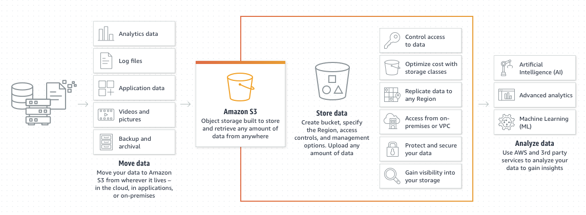

# S3 

## Simple storage service

## S3 Overview 

S3 is a simple storage service, it is object storage in the cloud, it provides secure, durable and highly scalable object storage. S3 allow you to store and retrieve any amount of data from anywhere on the web at a very low cost. Amazon S3 is easy to use, with a simple web service interface. 

Amazon Simple Storage Service (Amazon S3) is an object storage service offering industry-leading scalability, data availability, security, and performance. Millions of customers of all sizes and industries store, manage, analyze, and protect any amount of data for virtually any use case, such as data lakes, cloud-native applications, and mobile apps. With cost-effective storage classes and easy-to-use management features, you can optimize costs, organize and analyze data, and configure fine-tuned access controls to meet specific business and compliance requirements.

S3 is a object storage that manages data as objects rather than in file systems or data blocks. You can not run OS or database in S3. You can store any file type like photos, videos, code, documents and text files. 

- Unlimited Storage
- Objects up to 5TB in Size
- S3 buckets, store files in buckets similar to folder.
- Universal namespace. Your bucket name has to be globaly unique you will not be able to create a bucket with name "test" for example.
- S3 is build for availability - 99.95% - 99.99% service availability depending on S3 tier.
- S3 Standard - data stored redundantly across 3 multiples devices in 3 AZs - 99.99% available 99.999999999% (11 9's)
- Server side encryption
- Access Control List - ACLs
- Bucket policies  

### S3 use case

### Example S3 urls

https://bucket-name.s3.region.amazonaws.com/key-name

http://acloudguru.s3.us-east-1.amazonaws.com/Ralphie.jpg

- When uploading a file to an S3 bucket, you will receive an HTTP 200 response code if the upload was successful. 
- key usually is a name of object e.g. ralphie.jpg (file's name)
  

  ### ACLs vs Bucket policies

- ACLs work on an individual object level like a single file, you can make a file public or private, readable or writeable, download 
- Bucket policy work on an entire bucket level, if you want make all bucket publicly you can use bucket policy. 

- Buckets are private by the default. If you want turn it publicly you must allow public access on both the bucket and its objects.
- ACLs you can make individual objects public using object ACLs
- Bucket policies you can make entire bucket public using bucket policies
- When upload an object to s3 and it's successful you will receive an HTTP 200 code. 

### Creating our bucket 

- Lets create a new bucket called andregonzaga-bucket
- In Permissions make it "Block public access" as OFF
- Still in Permissions, in object ownership select the option "ACLs enabled"
- 
